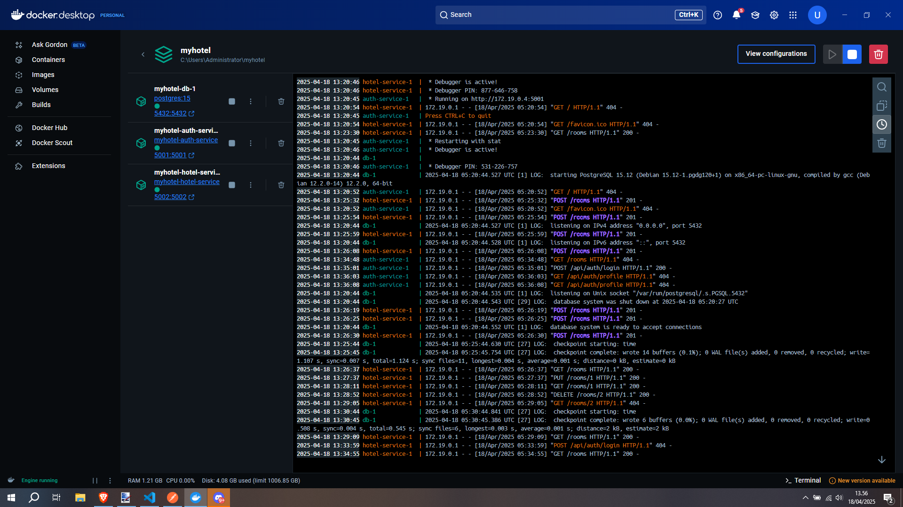
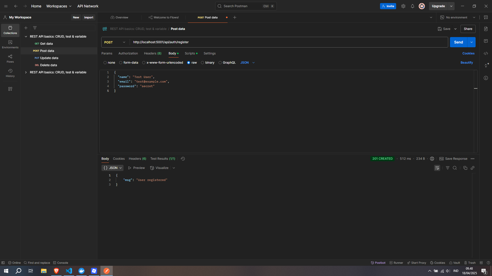
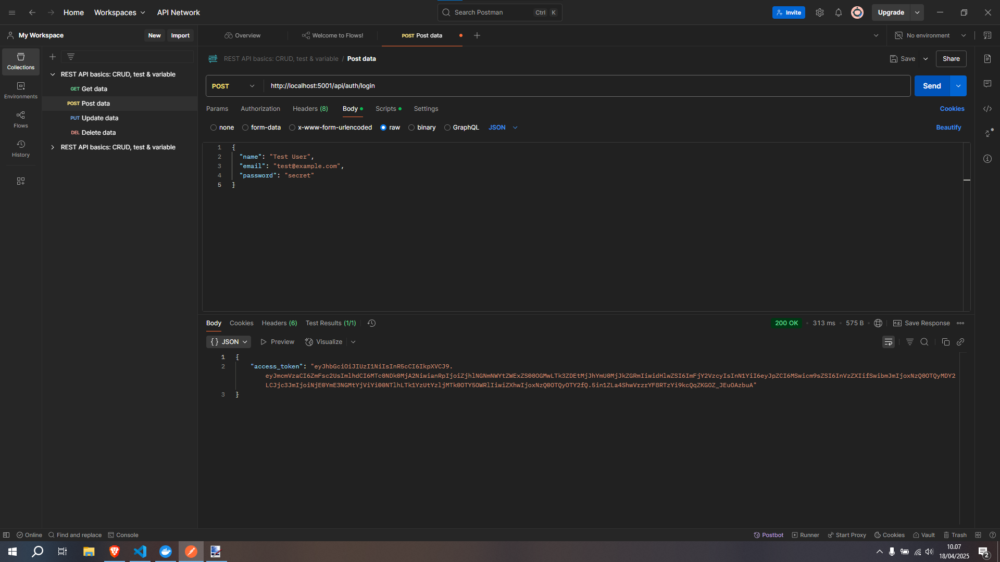
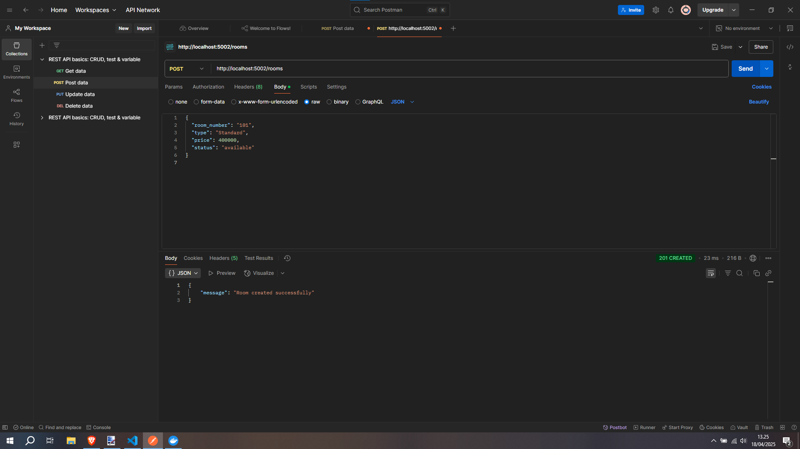
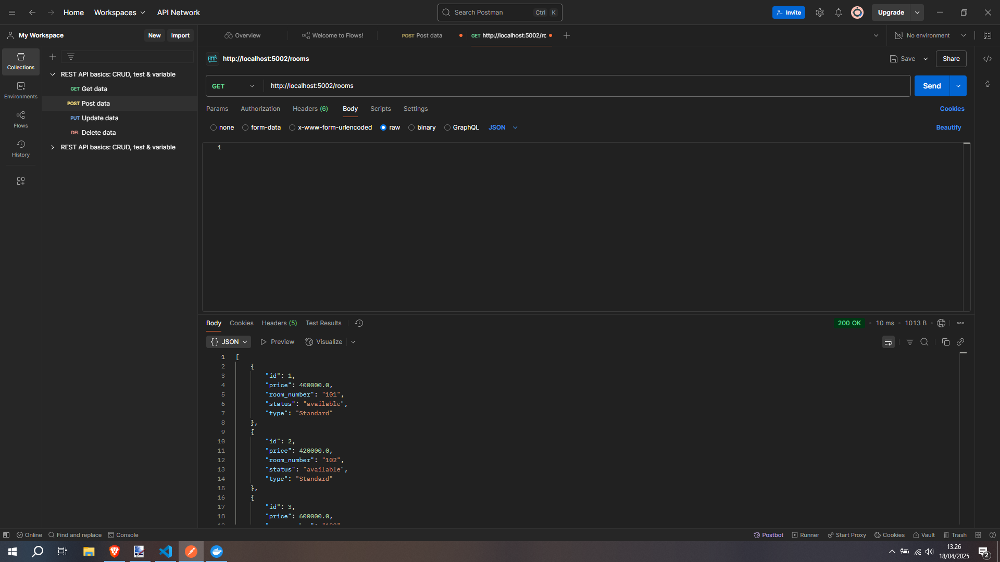
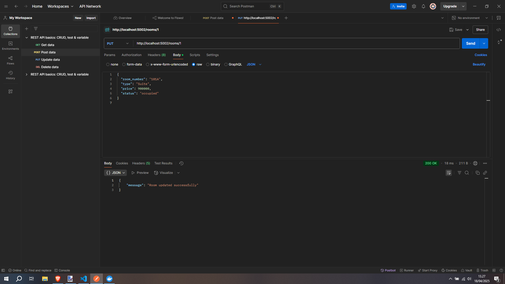
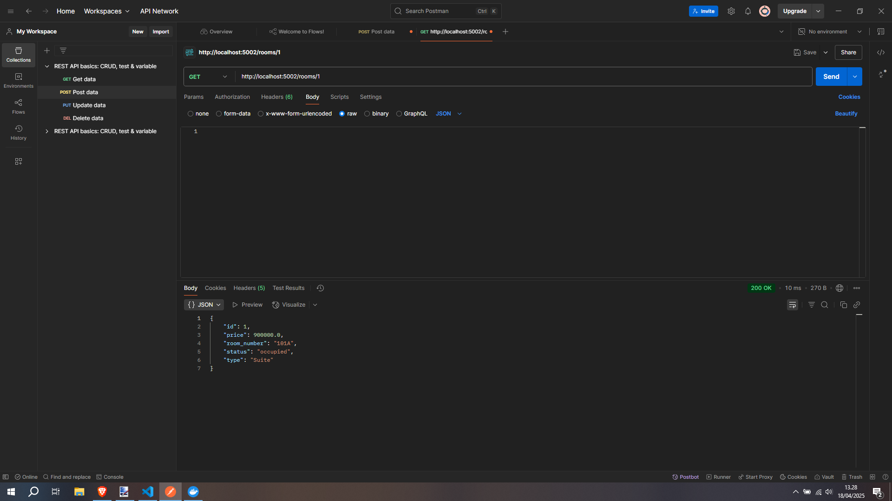
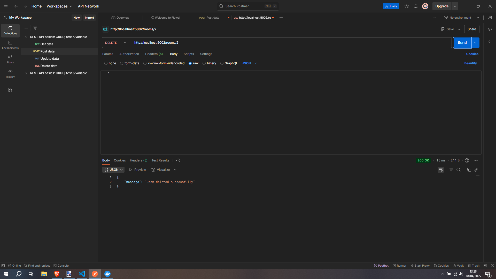
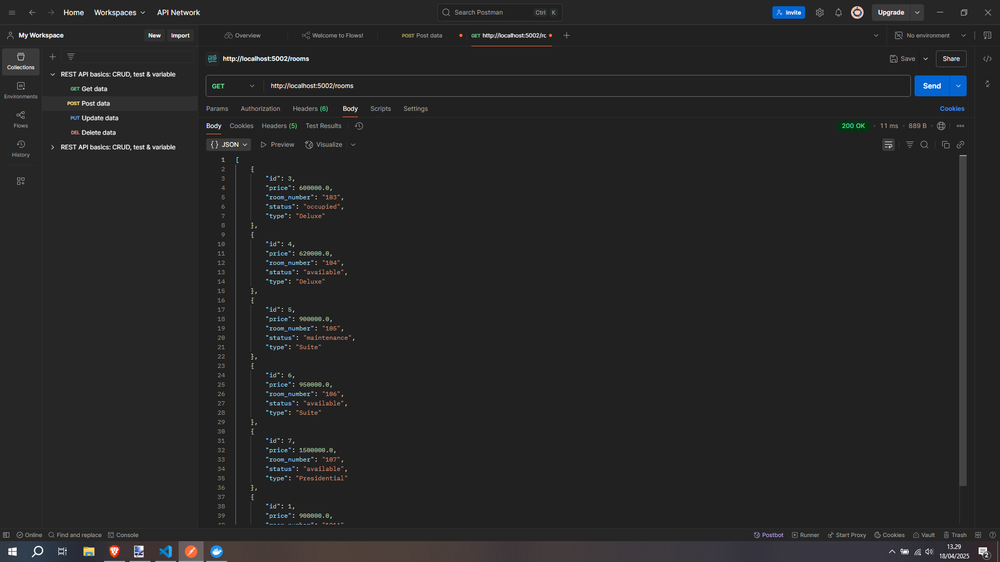

# Laporan Mingguan 10

## Kode Backend Service
[Masukkan deskripsi atau tautan ke kode backend service di sini, jika ada.]

## Skema Database
```sql
-- Masukkan skema database di sini
```

## Konfigurasi Dockerfile untuk Setiap Layanan

### docker-compose.yml
```yaml
version: "3.9"
services:
  db:
    image: postgres:15
    environment:
      POSTGRES_DB: myhotel
      POSTGRES_USER: payylayss
      POSTGRES_PASSWORD: payylayss
    ports:
      - "5432:5432"
    volumes:
      - pgdata:/var/lib/postgresql/data

  auth-service:
    build:
      context: ./services/backend/auth-service
    ports:
      - "5001:5001"
    environment:
      DB_HOST: db
      DB_NAME: myhotel
      DB_USER: payylayss
      DB_PASSWORD: payylayss
      JWT_SECRET_KEY: super-secret-key
    depends_on:
      - db

  hotel-service:
    build:
      context: ./services/backend/hotel-service
    ports:
      - "5002:5002"
    environment:
      DB_HOST: db
      DB_NAME: myhotel
      DB_USER: payylayss
      DB_PASSWORD: payylayss
    depends_on:
      - db

volumes:
  pgdata:
```

### Dockerfile: Auth Service
**Path:** `services/backend/auth-service/Dockerfile`
```dockerfile
FROM python:3.11-slim

WORKDIR /app

COPY requirements.txt .
RUN pip install --no-cache-dir -r requirements.txt

COPY . .

CMD ["python", "app.py"]
```

### Dockerfile: Hotel Service
**Path:** `services/backend/hotel-service/Dockerfile`
```dockerfile
FROM python:3.11-slim

WORKDIR /app

COPY requirements.txt .
RUN pip install --no-cache-dir -r requirements.txt

COPY . .

CMD ["python", "app.py"]
```

### Docker Container


## Dokumentasi Hasil Pengujian API dengan Postman

### Auth Service
#### Registrasi Pengguna


#### Login Pengguna


### Hotel Service - Room
#### Create Room
**Sebelum:**


#### View Rooms
**Setelah Create:**


#### Update Room
**Proses:**


**Hasil:**


#### Delete Room
**Proses:**


**Hasil:**


## Screenshot implementasi

