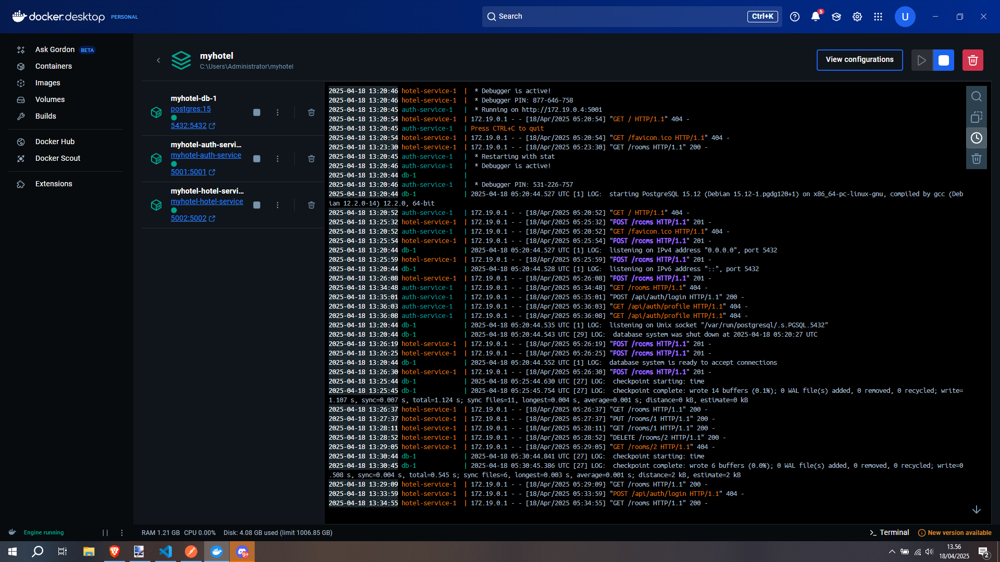
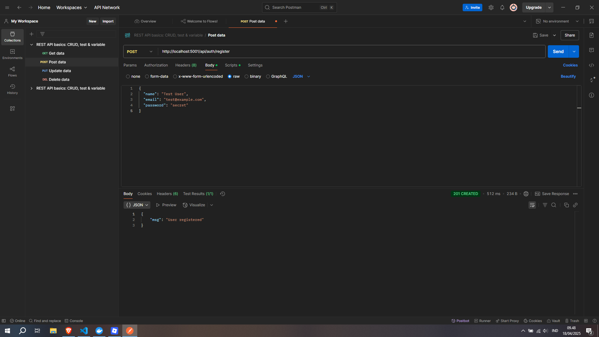
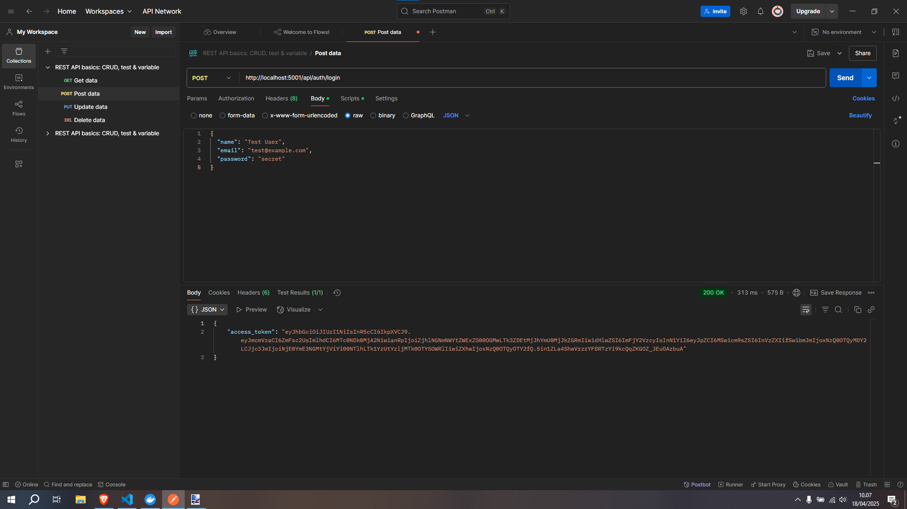
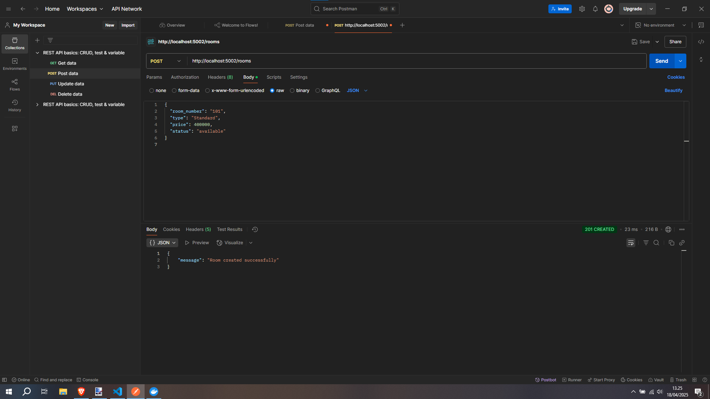
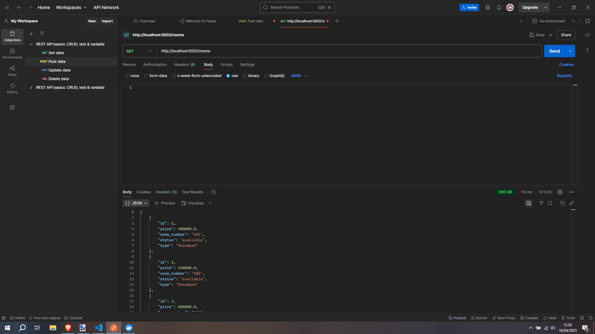
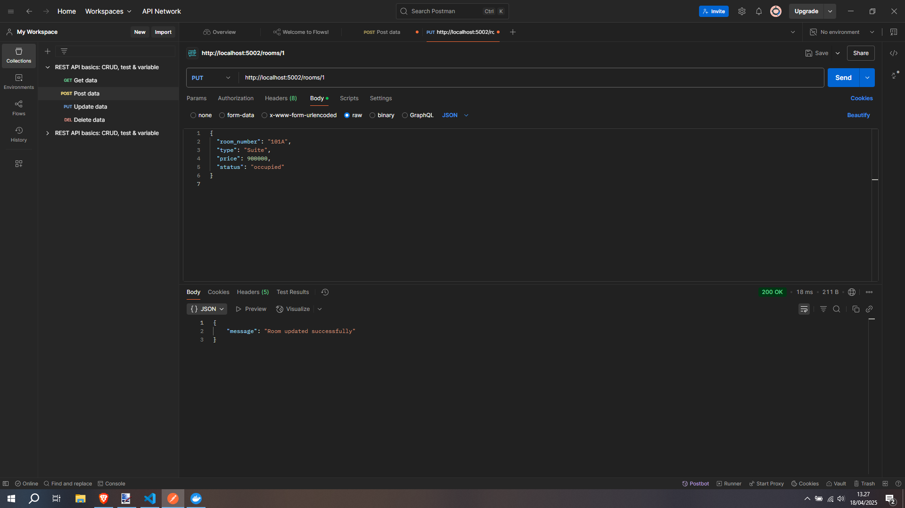
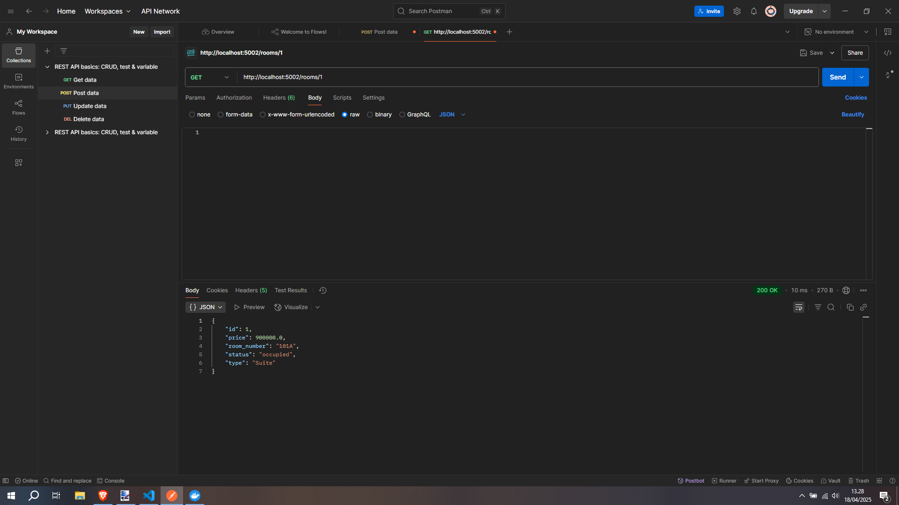
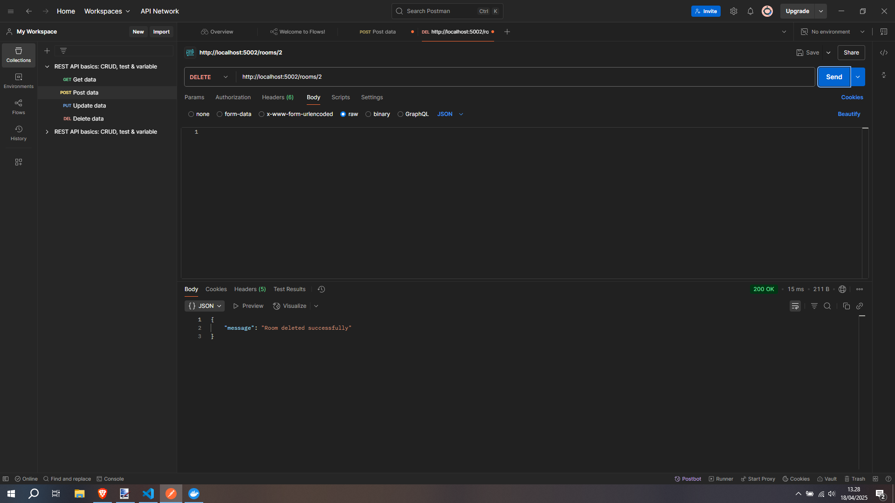
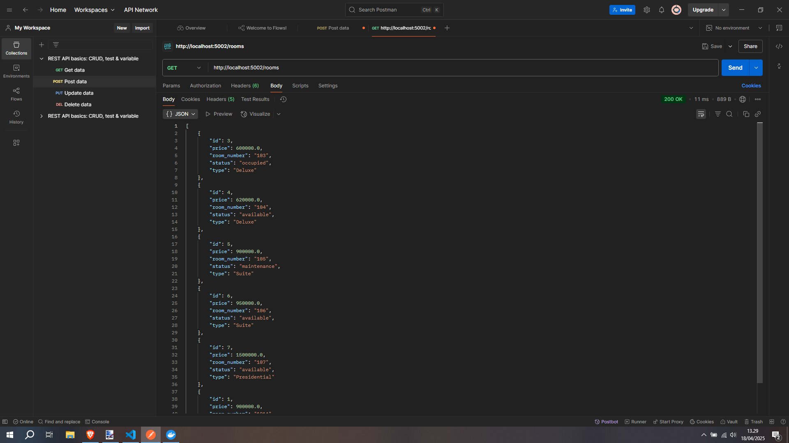

# Proyek Pengembangan Backend Microservices: MyHotel 🏨

### Anggota Tim 👥
1. **Taufik Ilham** – 10221081 -> Backend Engineer
2. **Efhy Wati Manalu** – 10221067 -> Frontend Engineer
3. **Priyo Galih Prasetyo** – 10221037 -> Infrastructure Engineer


## Deskripsi Proyek 🌐

Proyek ini bertujuan untuk membangun backend dari sistem manajemen hotel menggunakan pendekatan **microservices**. Terdapat dua layanan utama yang telah dikembangkan: **auth-service** untuk manajemen otentikasi pengguna dan **hotel-service** untuk manajemen kamar hotel. Setiap layanan dijalankan secara terpisah dan saling berinteraksi melalui API RESTful.

---

## Layanan yang Dibuat 🚀

### 1. **Auth-Service**
`auth-service` bertanggung jawab untuk menangani otentikasi dan otorisasi pengguna. Layanan ini menyediakan API untuk mendaftarkan pengguna baru, login, dan verifikasi token.

**Tahap Implementasi :** 

#### a. Membuat ERD untuk schema database


Entity Relationship Diagram ini menggambarkan struktur schema database yang akan dikerjakan. Terdapat 6 table database yaitu `users`, `bookings`, `rooms`, `check_ins`, `check_outs`, dan `notifications`

**🧩 Skema Relasi Utama:**

- User ↔ Bookings: One to Many
- Bookings ↔ Rooms: Many to One
- Bookings ↔ Check-in: One to One
- Bookings ↔ Check-out: One to One
- User ↔ Notifications: One to Many


#### b. Inisialisasi Proyek

Folder `auth-service` dibuat sebagai bagian dari arsitektur layanan mikroservice myhotel. Struktur dasar proyek disusun sebagai berikut:

```
auth-service/
│
├── app.py                  
├── config.py               
├── create_tables.py        
├── test_connection.py      
│
├── database/
│   └── db.py               
│
├── models/
│   └── user.py             
│
└── routes/
    └── auth_routes.py      
```

#### c. Membuat Database myhotel


Di tahap ini backend engineer membuat user dengan nama payylayss dan password payylayss. Lalu membuat database dengan nama myhotel dengan owner payylayss dan memberikan hak akses penuh.


#### d. Konfigurasi Database 

Pada tahap ini, aplikasi dikonfigurasi untuk terhubung ke database PostgreSQL. Konfigurasi menggunakan environment variable agar fleksibel dalam pengaturan deployment.

```py
# auth-service\config.py

import os

class Config:
    SQLALCHEMY_DATABASE_URI = (
        f"postgresql://{os.getenv('DB_USER', 'payylayss')}:"
        f"{os.getenv('DB_PASSWORD', 'payylayss')}@"
        f"{os.getenv('DB_HOST', 'localhost')}/"
        f"{os.getenv('DB_NAME', 'myhotel')}"
    )
    SQLALCHEMY_TRACK_MODIFICATIONS = False
    JWT_SECRET_KEY = os.getenv("JWT_SECRET_KEY", "super-secret-key")


#  auth-service\test_connection.py

from flask import Flask
from config import Config
from database.db import db
from sqlalchemy import text

app = Flask(__name__)
app.config.from_object(Config)
db.init_app(app)

with app.app_context():
    try:
        db.session.execute(text("SELECT 1"))
        print("✅ Database connected successfully!")
    except Exception as e:
        print(f"❌ Connection failed: {e}")

```


Lalu tes koneksi dengan running `python test_connection.py` maka hasilnya seperti dibawah ini.


#### e. Membuat Table users

Objek db dari SQLAlchemy diinisialisasi untuk digunakan oleh semua model. Model User didefinisikan untuk mencerminkan tabel users pada database

```py
# auth-service\database\db.py

from flask_sqlalchemy import SQLAlchemy

db = SQLAlchemy()


# auth-service\models\user.py

from database.db import db
from datetime import datetime

class User(db.Model):
    __tablename__ = 'users'
    
    id = db.Column(db.Integer, primary_key=True)
    name = db.Column(db.String(100), nullable=False)
    email = db.Column(db.String(100), unique=True, nullable=False)
    password_hash = db.Column(db.Text, nullable=False)
    role = db.Column(db.String(10), default='user')
    created_at = db.Column(db.DateTime, default=datetime.utcnow)


# create_tables.py

from flask import Flask
from config import Config
from database.db import db
from models.user import Room 

app = Flask(__name__)
app.config.from_object(Config)

db.init_app(app)

with app.app_context():
    db.create_all()
    print("✅ Tables users created successfully.")


```

Lalu Running `create_tables.py` untuk migrasi table users.


#### f. Menyusun Struktur Aplikasi Utama


File ini adalah entry point utama yang menjalankan service, mengatur JWT, CORS, serta melakukan registrasi blueprint untuk auth route:

#### g. Menambahkan Routing Otentikasi


Blueprint digunakan untuk modularisasi route terkait otentikasi dan memfasilitasi endpoint.


### 2. **Booking-Service**
`auth-service` bertanggung jawab untuk menangani otentikasi dan otorisasi pengguna. Layanan ini menyediakan API untuk mendaftarkan pengguna baru, login, dan verifikasi token.

**Tahap Implementasi :** 

#### a. Inisialisasi Proyek

Folder `auth-service` dibuat sebagai bagian dari arsitektur layanan mikroservice myhotel. Struktur dasar proyek disusun sebagai berikut:

```
booking-service/
│
├── app.py                  
├── config.py               
├── create_tables.py        
├── test_connection.py      
│
├── database/
│   └── db.py               
│
├── models/
│   └── user.py             
│
└── routes/
    └── booking_routes.py      
```

#### b. Konfigurasi Database 

Pada tahap ini, aplikasi dikonfigurasi untuk terhubung ke database PostgreSQL. Konfigurasi menggunakan environment variable agar fleksibel dalam pengaturan deployment.

```py
# hotel-service\config.py

import os

class Config:
    SQLALCHEMY_DATABASE_URI = (
        f"postgresql://{os.getenv('DB_USER', 'payylayss')}:"
        f"{os.getenv('DB_PASSWORD', 'payylayss')}@"
        f"{os.getenv('DB_HOST', 'localhost')}/"
        f"{os.getenv('DB_NAME', 'myhotel')}"
    )
    SQLALCHEMY_TRACK_MODIFICATIONS = False
    JWT_SECRET_KEY = os.getenv("JWT_SECRET_KEY", "super-secret-key")


#  hotel-service\test_connection.py

from flask import Flask
from config import Config
from database.db import db
from sqlalchemy import text

app = Flask(__name__)
app.config.from_object(Config)
db.init_app(app)

with app.app_context():
    try:
        db.session.execute(text("SELECT 1"))
        print("✅ Database connected successfully!")
    except Exception as e:
        print(f"❌ Connection failed: {e}")

```


Lalu tes koneksi dengan running `python test_connection.py` maka hasilnya seperti dibawah ini.


#### e. Membuat Table rooms

Objek db dari SQLAlchemy diinisialisasi untuk digunakan oleh semua model. Model Room didefinisikan untuk mencerminkan tabel rooms pada database

```py
# hotel-service\database\db.py

from flask_sqlalchemy import SQLAlchemy

db = SQLAlchemy()


# hotel-service\models\room.py

from database.db import db
from datetime import datetime

class Room(db.Model):
    __tablename__ = 'rooms'

    id = db.Column(db.Integer, primary_key=True)
    room_number = db.Column(db.String(20), unique=True, nullable=False)
    type = db.Column(db.String(50), nullable=False)
    price = db.Column(db.Numeric(10, 2), nullable=False)
    status = db.Column(db.Enum('available', 'occupied', 'maintenance', name='room_status'), default='available')
    created_at = db.Column(db.DateTime, default=datetime.utcnow)


# create_tables.py

from flask import Flask
from config import Config
from database.db import db
from models.room import Room

app = Flask(__name__)
app.config.from_object(Config)

db.init_app(app)

with app.app_context():
    db.create_all()
    print("✅ Tables rooms created successfully.")


```

Lalu Running `create_tables.py` untuk migrasi table users.


#### f. Menyusun Struktur Aplikasi Utama


File ini adalah entry point utama yang menjalankan service, mengatur JWT, CORS, serta melakukan registrasi blueprint untuk auth route:

#### g. Menambahkan Routing Otentikasi


Terdapat lima endpoint utama: `GET /rooms` untuk mengambil seluruh data kamar dari database dan mengembalikannya dalam format JSON, serta `GET /rooms/<room_id>` untuk mengambil data satu kamar berdasarkan ID tertentu. Endpoint `POST /rooms` digunakan untuk menambahkan kamar baru ke dalam database, menerima data berupa room_number, type, price, dan status melalui JSON request body. Selanjutnya, endpoint `PUT /rooms/<room_id>` berfungsi untuk memperbarui data kamar tertentu berdasarkan ID-nya, dengan data yang dikirimkan bisa sebagian saja dari atribut yang tersedia. Terakhir, endpoint `DELETE /rooms/<room_id>` digunakan untuk menghapus data kamar dari database berdasarkan ID. Seluruh endpoint ini mengimplementasikan operasi CRUD (Create, Read, Update, Delete) dan berperan penting dalam manajemen data kamar pada layanan backend sistem hotel berbasis Flask.

## Skema Database

Skema database telah diletakkan di folder `myhotel\db` sehingga hanya perlu restore saja di pgAdmin.

## Dokumentasi Docker

Berikut adalahKonfigurasi Dockerfile untuk Setiap Layanan

### docker-compose.yml
```yaml
version: "3.9"
services:
  db:
    image: postgres:15
    environment:
      POSTGRES_DB: myhotel
      POSTGRES_USER: payylayss
      POSTGRES_PASSWORD: payylayss
    ports:
      - "5432:5432"
    volumes:
      - pgdata:/var/lib/postgresql/data

  auth-service:
    build:
      context: ./services/backend/auth-service
    ports:
      - "5001:5001"
    environment:
      DB_HOST: db
      DB_NAME: myhotel
      DB_USER: payylayss
      DB_PASSWORD: payylayss
      JWT_SECRET_KEY: super-secret-key
    depends_on:
      - db

  hotel-service:
    build:
      context: ./services/backend/hotel-service
    ports:
      - "5002:5002"
    environment:
      DB_HOST: db
      DB_NAME: myhotel
      DB_USER: payylayss
      DB_PASSWORD: payylayss
    depends_on:
      - db

volumes:
  pgdata:
```

### Dockerfile: Auth Service
**Path:** `services/backend/auth-service/Dockerfile`
```dockerfile
FROM python:3.11-slim

WORKDIR /app

COPY requirements.txt .
RUN pip install --no-cache-dir -r requirements.txt

COPY . .

CMD ["python", "app.py"]
```

### Dockerfile: Hotel Service
**Path:** `services/backend/hotel-service/Dockerfile`
```dockerfile
FROM python:3.11-slim

WORKDIR /app

COPY requirements.txt .
RUN pip install --no-cache-dir -r requirements.txt

COPY . .

CMD ["python", "app.py"]
```

### Docker Container


## Dokumentasi Hasil Pengujian API dengan Postman

### Auth Service
#### Registrasi Pengguna


#### Login Pengguna


### Hotel Service - Room
#### Create Room
**Sebelum:**


#### View Rooms
**Setelah Create:**


#### Update Room
**Proses:**


**Hasil:**


#### Delete Room
**Proses:**


**Hasil:**
