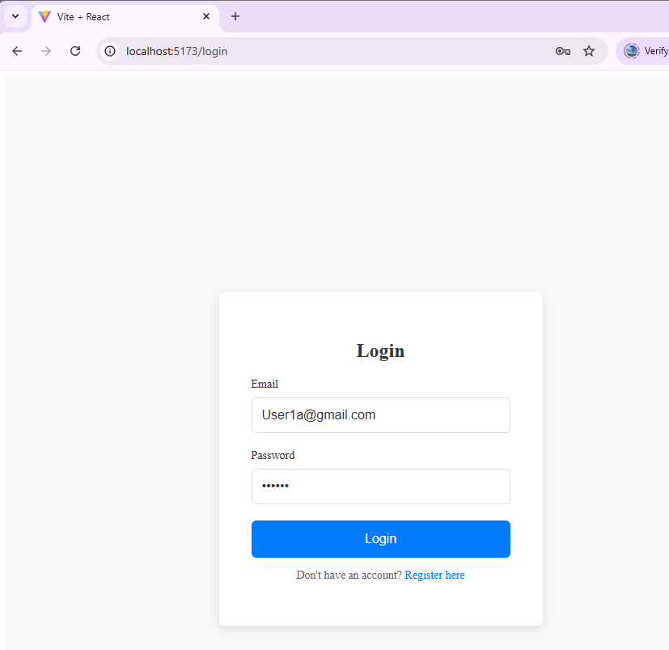
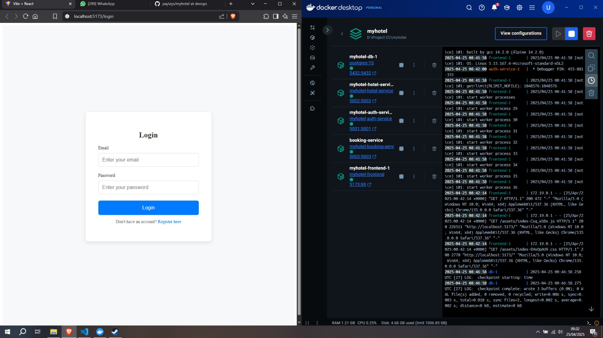

# Proyek Pengembangan Frontend: MyHotel 🏨

### Anggota Tim 👥
1. **Taufik Ilham** – 10221081 -> Backend Engineer
2. **Efhy Wati Manalu** – 10221067 -> Frontend Engineer
3. **Priyo Galih Prasetyo** – 10221037 -> Infrastructure Engineer


## Deskripsi Proyek 🌐

Pada pekan ini, fokus utama adalah pengembangan frontend dari sistem manajemen hotel menggunakan React dan Vite, dengan halaman utama yang dikembangkan meliputi dashboard, login, dan register. UI ini dirancang agar responsif dan mudah digunakan, khususnya untuk mendukung fitur layanan pemesanan kamar (booking service) yang telah direncanakan sebelumnya.

Integrasi frontend dengan backend dilakukan menggunakan fetch dan axios untuk mengambil serta menampilkan data dari layanan API, termasuk booking service. Selain itu, dibuat juga Dockerfile untuk frontend agar dapat dijalankan.

---

## Pengembangan UI denganReact + Vite : 

Pengembangan frontend dari sistem manajemen hotel menggunakan React dan Vite. React dipilih karena fleksibilitasnya dalam membangun UI berbasis komponen yang modular, sementara Vite digunakan karena kecepatan build-nya yang tinggi dan dukungan hot reload yang efisien. Struktur proyek frontend terdiri dari folder src sebagai inti kode, dengan subfolder seperti components yang memuat komponen fungsional seperti DashboardAdmin.jsx, Login.jsx, dan Register.jsx, serta pages dan assets untuk pengelolaan halaman dan aset visual. Seluruh komponen frontend telah terhubung dengan backend melalui integrasi API menggunakan fetch dan axios, memungkinkan aplikasi untuk menangani data secara dinamis dan responsif.

---

#### Struktur Proyek
Struktur dasar proyek disusun sebagai berikut:

```
frontend/
├── app-react/             
├── node_modules/         
├── public/                
├── src/                   
│   ├── assets/            
│   │   └── react.svg
│   ├── components/       
│   │   ├── DashboardAdmin.jsx
│   │   ├── Login.jsx
│   │   ├── Register.jsx
│   │   └── App.jsx        
│   ├── Auth.css          
│   ├── main.jsx           
│   └── ...      
```

## Layanan yang Dibuat 🚀

### 1. **Dashboard**

---
---


Pada halaman ini, khususnya bagian "Reservasi Sekarang" memungkinkan pengguna memasukkan detail pemesanan (tanggal check-in/out, jumlah tamu), akan berinteraksi dengan layanan `reservation-service` di backend. Secara spesifik, ketika pengguna melakukan pengecekan ketersediaan, frontend akan mengirimkan permintaan ke endpoint `/availability`. Setelah pengguna mengisi detail dan melakukan pemesanan, data akan dikirimkan melalui endpoint `/book` pada layanan yang sama.

```py
#DashboardAdmin.jsx

import React, { useState } from 'react';
import { useNavigate } from 'react-router-dom';

const DashboardAdmin = () => {
  const navigate = useNavigate();
  const [hotelServices, setHotelServices] = useState([
    { id: 1, name: 'Room Service', price: '100 USD' },
    { id: 2, name: 'Spa Service', price: '50 USD' },
    { id: 3, name: 'Pool Access', price: '30 USD' },
    // Tambahkan data lainnya sesuai kebutuhan
  ]);

  // Fungsi untuk menangani logout
  const handleLogout = () => {
    const confirmLogout = window.confirm("Are you sure you want to logout?");
    if (confirmLogout) {
      localStorage.removeItem('access_token');
      navigate('/login');
    }
  };

  // Fungsi untuk menambah data layanan baru (misalnya membuka form)
  const handleAddService = () => {
    // Ini bisa diarahkan ke form untuk menambah data layanan
    navigate('/admin/service/add'); // Gantilah path sesuai kebutuhan
  };

  return (
    <div className="dashboard">
      <h2>Admin Dashboard</h2>
      <p>Welcome to the admin dashboard!</p>

      {/* Tombol Logout */}
      <button onClick={handleLogout} className="logout-btn">
        Logout
      </button>

      {/* Judul Tabel */}
      <div className="table-header">
        <h3>Hotel Services</h3>
        <button onClick={handleAddService} className="btn-add">
          Add Service
        </button>
      </div>

      {/* Tabel Layanan Hotel */}
      <table className="hotel-service-table">
        <thead>
          <tr>
            <th>ID</th>
            <th>Service Name</th>
            <th>Price</th>
            <th>Actions</th>
          </tr>
        </thead>
        <tbody>
          {hotelServices.map((service) => (
            <tr key={service.id}>
              <td>{service.id}</td>
              <td>{service.name}</td>
              <td>{service.price}</td>
              <td>
                <button className="btn-edit">Edit</button>
                <button className="btn-delete">Delete</button>
              </td>
            </tr>
          ))}
        </tbody>
      </table>
    </div>
  );
};

export default DashboardAdmin;
```


### 2. **Register Page**
](images/register.png)
Page ini ialah antarmuka untuk halaman pendaftaran pengguna baru dengan judul "Register" dengan input, `Name` sebagai identitas user,`kolom Email`, dan `kolom Password` yang akan dikirimkan melalui permintaan POST ke endpoint http://localhost:5173/register.Respons dari backend akan menentukan apakah pendaftaran berhasil atau gagal.

```py
#Register.jsx

import React, { useState } from 'react';
import '../Auth.css';

const Register = () => {
  const [name, setName] = useState('');
  const [email, setEmail] = useState('');
  const [password, setPassword] = useState('');

  const handleRegister = async (e) => {
    e.preventDefault();

    const response = await fetch('http://localhost:5001/api/auth/register', {
      method: 'POST',
      headers: {
        'Content-Type': 'application/json',
      },
      body: JSON.stringify({ name, email, password }),
    });

    const data = await response.json();

    if (response.status === 201) {
      alert('Registration Successful');
      setName('');
      setEmail('');
      setPassword('');
      setError('');
    } else {
      setError(data.msg || 'Registration Failed');
    }
  };

  return (
    <div className="auth-container">
      <div className="auth-form">
        <h2>Register</h2>
        <form onSubmit={handleRegister}>
          <div className="input-group">
            <label>Name</label>
            <input
              type="text"
              placeholder="Enter your name"
              value={name}
              onChange={(e) => setName(e.target.value)}
              required
            />
          </div>
          <div className="input-group">
            <label>Email</label>
            <input
              type="email"
              placeholder="Enter your email"
              value={email}
              onChange={(e) => setEmail(e.target.value)}
              required
            />
          </div>
          <div className="input-group">
            <label>Password</label>
            <input
              type="password"
              placeholder="Enter your password"
              value={password}
              onChange={(e) => setPassword(e.target.value)}
              required
            />
          </div>
          <button type="submit" className="btn-submit">Register</button>
        </form>
        <p>Already have an account? <a href="/login">Login here</a></p>
      </div>
    </div>
  );
};

export default Register;

```

### 3. **Login Page**

Bagi pengguna yang telah memiliki akun, terdapat tautan `"Already have an account? Login here"` yang berfungsi sebagai navigasi langsung menuju halaman login."

```py
#Login.jsx

import React, { useState } from 'react';
import '../Auth.css';
import { useNavigate } from 'react-router-dom';

const Login = () => {
  const [email, setEmail] = useState('');
  const [password, setPassword] = useState('');
  const [error, setError] = useState('');
  const navigate = useNavigate();

  const handleLogin = async (e) => {
    e.preventDefault();

    const response = await fetch('http://localhost:5001/api/auth/login', {
      method: 'POST',
      headers: {
        'Content-Type': 'application/json',
      },
      body: JSON.stringify({ email, password }),
    });

    const data = await response.json();

    if (response.status === 200) {
      // Simpan token JWT ke localStorage
      localStorage.setItem('access_token', data.access_token);
      alert('Login Successful');
      // Redirect ke /admin/dashboard setelah login berhasil
      navigate('/admin/dashboard');
    } else {
      setError(data.msg || 'Login Failed');
    }
  };

  return (
    <div className="auth-container">
      <div className="auth-form">
        <h2>Login</h2>
        {error && <p style={{ color: 'red', textAlign: 'center' }}>{error}</p>}  {/* Menampilkan error */}
        <form onSubmit={handleLogin}>
          <div className="input-group">
            <label>Email</label>
            <input
              type="email"
              placeholder="Enter your email"
              value={email}
              onChange={(e) => setEmail(e.target.value)}
              required
            />
          </div>
          <div className="input-group">
            <label>Password</label>
            <input
              type="password"
              placeholder="Enter your password"
              value={password}
              onChange={(e) => setPassword(e.target.value)}
              required
            />
          </div>
          <button type="submit" className="btn-submit">Login</button>
        </form>
        <p>Don't have an account? <a href="/register">Register here</a></p>
      </div>
    </div>
  );
};

export default Login;

```
### 4. **app-react/Dockerfile**

```py
# Gunakan image node untuk tahap build
FROM node:20-alpine AS build

WORKDIR /app

# Salin file proyek ke container
COPY . .

# Install dependencies
RUN npm install

# Build aplikasi
RUN npm run build

# Gunakan Nginx untuk serving file build
FROM nginx:alpine

# Copy hasil build ke folder Nginx
COPY --from=build /app/dist /usr/share/nginx/html

# Salin konfigurasi default Nginx (opsional)
COPY nginx.conf /etc/nginx/conf.d/default.conf

EXPOSE 80

CMD ["nginx", "-g", "daemon off;"]
```
Dockerfile ini melakukan multi-stage build. Pertama, ia menggunakan Node.js untuk membangun aplikasi React. Kemudian, ia menggunakan Nginx untuk menyajikan file-file hasil build. Pendekatan ini efisien karena image akhir hanya berisi file-file yang dibutuhkan untuk menjalankan aplikasi, bukan semua dependencies Node.js.

### 5. **docker-compose.yml**
```py
docker-compose.yml


version: "3.9"

services:
  db:
    image: postgres:15
    environment:
      POSTGRES_DB: myhotel
      POSTGRES_USER: payylayss
      POSTGRES_PASSWORD: payylayss
    ports:
      - "5432:5432"
    volumes:
      - pgdata:/var/lib/postgresql/data

  auth-service:
    build:
      context: ./services/backend/auth-service
    ports:
      - "5001:5001"
    environment:
      DB_HOST: db
      DB_NAME: myhotel
      DB_USER: payylayss
      DB_PASSWORD: payylayss
      JWT_SECRET_KEY: super-secret-key
    depends_on:
      - db

  hotel-service:
    build:
      context: ./services/backend/hotel-service
    ports:
      - "5002:5002"
    environment:
      DB_HOST: db
      DB_NAME: myhotel
      DB_USER: payylayss
      DB_PASSWORD: payylayss
    depends_on:
      - db

  booking-service:
    build:
      context: ./services/backend/booking-service
    container_name: booking-service
    ports:
      - "5003:5003"
    environment:
      DB_USER: payylayss
      DB_PASSWORD: payylayss
      DB_HOST: db
      DB_NAME: myhotel
    depends_on:
      - db

  frontend:
    build:
      context: ./services/frontend/app-react
    ports:
      - "5173:80"
    depends_on:
      - auth-service
      - hotel-service
      - booking-service

volumes:
  pgdata:

```
docker-compose.yml ini mengatur orkestrasi dari seluruh aplikasi MyHotel. Ia mendefinisikan bagaimana setiap service dibangun, dikonfigurasi, dan saling terhubung. Docker Compose memudahkan untuk menjalankan dan mengelola aplikasi multi-container.

---
---
Kesimpulannya, direktori `/services/frontend` dalam proyek MyHotel bertindak sebagai klien yang mengirimkan permintaan ke berbagai endpoint API yang disediakan oleh layanan-layanan backend. Setiap komponen di dalam  `/services/frontend/src/components/`, seperti `DashboardAdmin.jsx`, `Login.jsx` akan berinteraksi dengan layanan backend. Komponen alur pemesanan akan berkomunikasi dengan `reservation-service`, komponen autentikasi `(Login.jsx, Register.jsx)` akan berinteraksi dengan `auth-service`, dan komponen administratif `(DashboardAdmin.jsx)` akan terhubung dengan berbagai endpoint pada `reservation-service ` dan mungkin `hotel-service`. Seluruh logika untuk tampilan antarmuka pengguna dan orkestrasi interaksi dengan backend ini terpusat dan terorganisir di dalam direktori `/services/frontend/src/` dan subdirektorinya.


