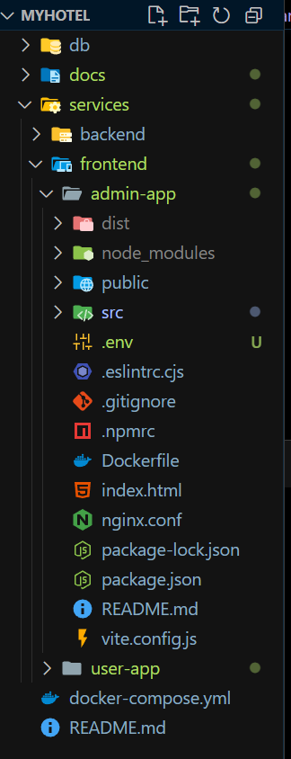
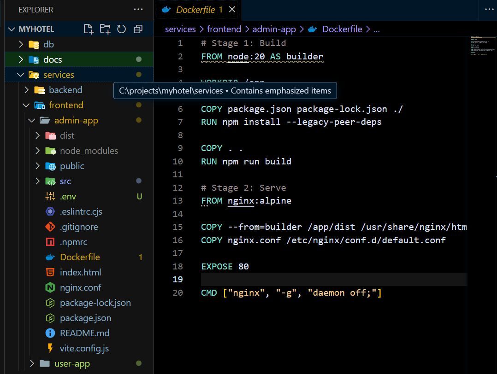
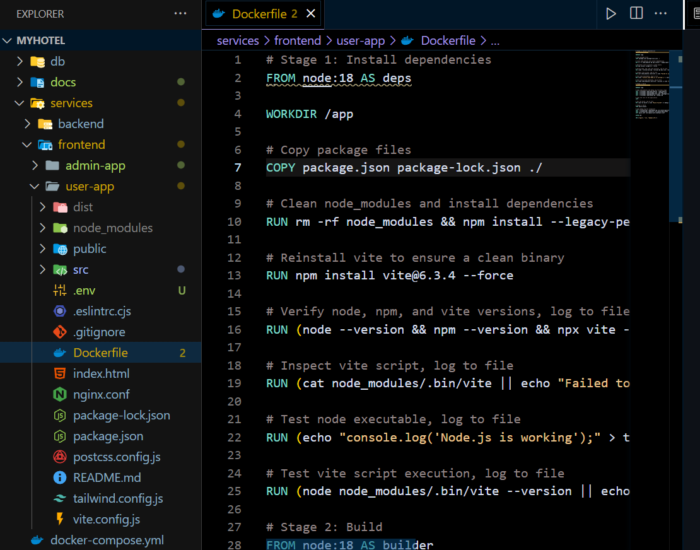
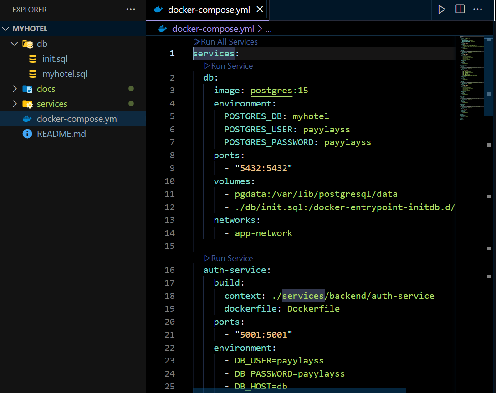
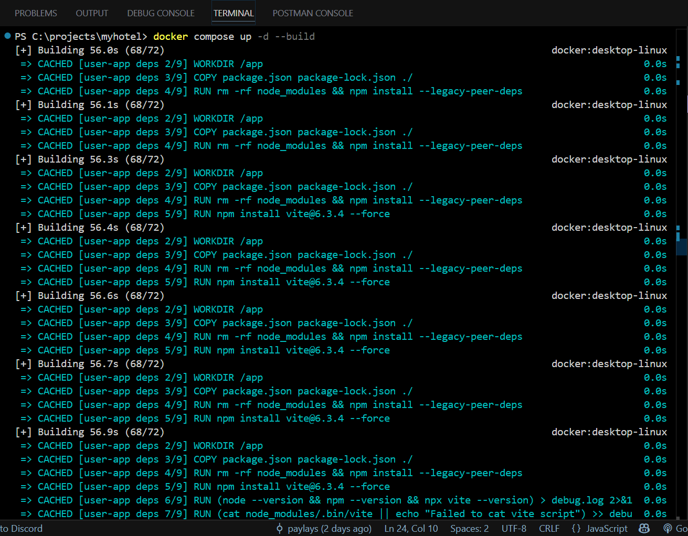
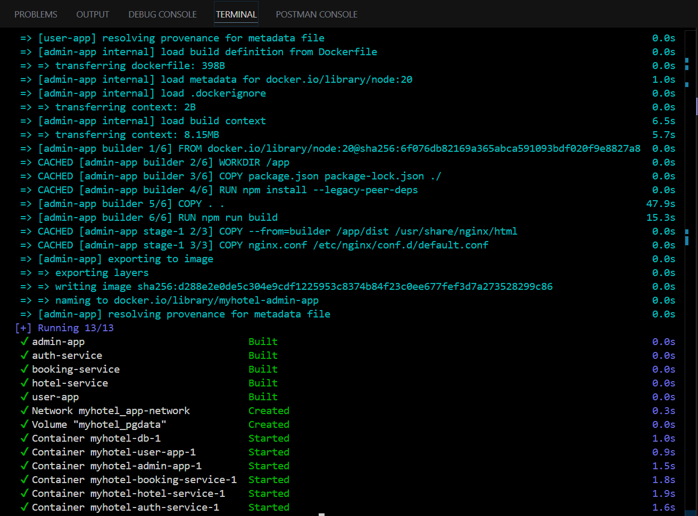
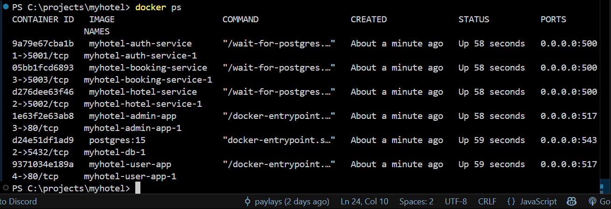

# Laporan CC Week-12 Implementasi dan Dockerisasi Frontend

**Oleh Kelompok 6**

**Anggota Tim:**
- Taufik Ilham – 10221081
- Efhy Wati Manalu – 10221067
- Priyo Galih Prasetyo – 10221037

---

## Tugas Minggu 12

1. **Implementasi Frontend**: Mengembangkan `user-app` dan `admin-app` sebagai antarmuka pengguna dan admin untuk aplikasi **MyHotel**.
2. **Komunikasi Frontend dengan Backend**: Mengatur komunikasi HTTP antara frontend (`user-app`, `admin-app`) dan layanan backend (`auth-service`, `booking-service`, `hotel-service`).
3. **Dockerisasi Frontend**: Membuat `Dockerfile` dan mengintegrasikan `user-app` dan `admin-app` ke dalam `docker-compose.yml` untuk menjalankan layanan frontend dalam container.
4. **Deliverable**:
   - Dokumen proyek dalam format Markdown yang menjelaskan progres minggu 12.
   - File Docker Compose yang mencakup konfigurasi layanan frontend.
   - Dokumentasi komunikasi frontend-backend.
   - Screenshot proses dan hasil dengan deskripsi komprehensif.
   - Video demo (opsional) yang menunjukkan frontend berjalan dengan Docker Compose.

---

## Pendahuluan

Pada minggu 12, tim kami fokus pada implementasi dan dockerisasi layanan frontend aplikasi **MyHotel**, yaitu `user-app` (untuk pengguna akhir) dan `admin-app` (untuk admin). Kedua aplikasi ini dibangun menggunakan Node.js dan disajikan melalui NGINX dalam container Docker. Kami juga mengatur komunikasi HTTP antara frontend dan layanan backend (`auth-service`, `booking-service`, `hotel-service`) yang telah diimplementasikan sebelumnya. Dockerisasi frontend dilakukan dengan menambahkan konfigurasi ke `docker-compose.yml`, memastikan integrasi dengan jaringan yang ada dan komunikasi yang lancar dengan backend.

---

## Struktur Frontend

- **user-app**:
  - Fungsi: Menyediakan antarmuka untuk pengguna akhir, termasuk login, registrasi, pencarian kamar, melihat detail kamar, riwayat pemesanan, dan daftar kamar tersedia.
  - Endpoint: `http://localhost:5174`.
  - Teknologi: Node.js (framework seperti React/Vue), disajikan melalui NGINX.
  - Komunikasi: Mengirim HTTP request ke `auth-service` (untuk otentikasi) dan `booking-service` (untuk pemesanan).

- **admin-app**:
  - Fungsi: Menyediakan antarmuka untuk admin, termasuk login, manajemen kamar, dan manajemen pemesanan.
  - Endpoint: `http://localhost:5173`.
  - Teknologi: Node.js, disajikan melalui NGINX.
  - Komunikasi: Mengirim HTTP request ke `auth-service` (untuk otentikasi), `hotel-service` (untuk manajemen kamar), dan `booking-service` (untuk manajemen pemesanan).

---

## Proses Implementasi dan Dockerisasi

### 1. Implementasi Frontend

- **user-app**:
  - Mengembangkan halaman untuk:
    - **Login** (`/login`): Formulir untuk memasukkan email dan kata sandi.
    - **Registrasi** (`/register`): Formulir untuk membuat akun baru.
    - **Pencarian Kamar** (`/room`): Menampilkan daftar kamar berdasarkan filter.
    - **Detail Kamar** (`/room_details`): Menampilkan informasi detail kamar.
    - **Riwayat Pemesanan** (`/booking-history`): Menampilkan riwayat pemesanan pengguna.
    - **Kamar Tersedia** (`/available-rooms`): Menampilkan kamar yang tersedia untuk dipesan.
  - Menggunakan framework frontend (misalnya, React) untuk membangun UI yang responsif.
  - Mengintegrasikan API call menggunakan `fetch` atau `axios` untuk berkomunikasi dengan backend.

- **admin-app**:
  - Mengembangkan halaman untuk:
    - **Login** (`/login`): Formulir otentikasi admin.
    - **Manajemen Kamar** (`/rooms`): Menambah, mengedit, atau menghapus kamar.
    - **Manajemen Pemesanan** (`/bookings`): Melihat dan mengelola pemesanan.
  - Menggunakan desain serupa dengan `user-app` untuk konsistensi UI.
  - Mengintegrasikan API call ke endpoint backend yang relevan.

### 2. Komunikasi Frontend dengan Backend

- **user-app**:
  - **auth-service** (`http://auth-service:5001`):
    - `POST /login`: Mengirim email dan kata sandi untuk otentikasi.
    - `POST /register`: Mengirim data pengguna untuk registrasi.
  - **booking-service** (`http://booking-service:5003`):
    - `GET /rooms`: Mengambil daftar kamar tersedia.
    - `GET /bookings`: Mengambil riwayat pemesanan.
    - `POST /bookings`: Membuat pemesanan baru.
  - Contoh kode (React):
    ```javascript
    async function login(email, password) {
      const response = await fetch('http://auth-service:5001/login', {
        method: 'POST',
        headers: { 'Content-Type': 'application/json' },
        body: JSON.stringify({ email, password }),
      });
      return response.json();
    }
    ```

- **admin-app**:
  - **auth-service** (`http://auth-service:5001`):
    - `POST /login`: Otentikasi admin.
  - **hotel-service** (`http://hotel-service:5002`):
    - `GET /rooms`: Mengambil daftar kamar.
    - `POST /rooms`: Menambah kamar baru.
    - `PUT /rooms/:id`: Memperbarui kamar.
    - `DELETE /rooms/:id`: Menghapus kamar.
  - **booking-service** (`http://booking-service:5003`):
    - `GET /bookings`: Mengambil semua pemesanan.
    - `DELETE /bookings/:id`: Membatalkan pemesanan.
  - Contoh kode (React):
    ```javascript
    async function addRoom(roomData) {
      const response = await fetch('http://hotel-service:5002/rooms', {
        method: 'POST',
        headers: { 'Content-Type': 'application/json' },
        body: JSON.stringify(roomData),
      });
      return response.json();
    }
    ```

- **Jaringan**:
  - Frontend menggunakan nama service (`auth-service`, `booking-service`, `hotel-service`) sebagai hostname, yang diresolusi oleh jaringan Docker (`myhotel-network`).
  - Komunikasi dilakukan melalui HTTP request dalam container, memastikan isolasi dan keamanan.

### 3. Dockerisasi Frontend

- **Pembuatan Dockerfile**:
  - Untuk `user-app` dan `admin-app`, kami membuat `Dockerfile` dengan dua tahap:
    ```dockerfile
    # Tahap 1: Build aplikasi frontend
    FROM node:18 AS builder
    WORKDIR /app
    COPY package.json package-lock.json ./
    RUN npm install --legacy-peer-deps
    COPY . .
    RUN npm run build

    # Tahap 2: Sajikan dengan NGINX
    FROM nginx:alpine
    ```
    - **Tahap 1**: Menggunakan `node:18` untuk menginstal dependensi dan membangun aplikasi.
    - **Tahap 2**: Menyalin hasil build ke `nginx:alpine` untuk penyajian statis.
    - File `nginx.conf` mengatur routing untuk aplikasi single-page.

- **Integrasi ke Docker Compose**:
  - Menambahkan layanan `user-app` dan `admin-app` ke `docker-compose.yml`:
    ```yaml
    services:
      user-app:
        build:
          context: ./services/frontend/user-app
        ports:
          - "5174:80"
        depends_on:
          - auth-service
          - booking-service
        networks:
          - myhotel-network

      admin-app:
        build:
          context: ./services/frontend/admin-app
        ports:
          - "5173:80"
        depends_on:
          - auth-service
          - hotel-service
          - booking-service
        networks:
          - myhotel-network

    networks:
      myhotel-network:
        driver: bridge
    ```
    - **ports**: Memetakan port container (80) ke port host (5174 untuk `user-app`, 5173 untuk `admin-app`).
    - **depends_on**: Memastikan frontend hanya mulai setelah backend tersedia.
    - **networks**: Menghubungkan frontend ke `myhotel-network` untuk komunikasi dengan backend.

\

### 4. Pengujian

- **Menjalankan Frontend**:
  ```bash
  cd D:\Project CC\week-12\myhotel
  docker-compose up -d --build
  ```
  - Membangun dan menjalankan container untuk `user-app` dan `admin-app`.

- **Memeriksa Status**:
  ```bash
  docker ps -a
  ```
  - Memastikan container `myhotel-user-app-1` dan `myhotel-admin-app-1` dalam status `Up`.

- **Memeriksa Log**:
  ```bash
  docker-compose logs user-app admin-app
  ```
  - Mengonfirmasi NGINX berjalan tanpa error.

- **Menguji Aplikasi**:
  - **user-app** (`http://localhost:5174`):
    - Login dengan kredensial valid.
    - Mendaftar pengguna baru.
    - Mencari kamar dan membuat pemesanan.
    - Melihat riwayat pemesanan.
  - **admin-app** (`http://localhost:5173`):
    - Login sebagai admin.
    - Menambah kamar baru.
    - Mengelola pemesanan.
  - Memastikan semua request HTTP ke backend berhasil.

---

## Screenshot Proses dan Hasil

### Screenshot 1: Struktur Direktori Frontend



**Deskripsi**: Menunjukkan struktur folder untuk `user-app` dan `admin-app` di `services/frontend`, termasuk `Dockerfile`, `package.json`, dan `nginx.conf`.

### Screenshot 2: Dockerfile Frontend



**Deskripsi**: Menampilkan isi `Dockerfile` untuk `user-app`, menunjukkan tahap build dan penyajian dengan NGINX.

### Screenshot 3: Konfigurasi Docker Compose


**Deskripsi**: Menunjukkan bagian `user-app` dan `admin-app` dalam `docker-compose.yml`.

### Screenshot 4: Build dan Run



**Deskripsi**: Output perintah `docker-compose up -d --build`, mengonfirmasi container frontend berjalan.

### Screenshot 5: Status Container

**Deskripsi**: Output `docker ps`, menunjukkan seluruh container dalam status `Up`.

---

## Dokumentasi Komunikasi Frontend-Backend

- **Mekanisme Komunikasi**:
  - Frontend mengirim HTTP request (GET, POST, PUT, DELETE) ke endpoint backend menggunakan nama service (misalnya, `http://auth-service:5001`).
  - Request dilakukan melalui jaringan `myhotel-network`, yang menghubungkan frontend dan backend.
  - Response dari backend (JSON) digunakan untuk memperbarui UI.

- **Contoh Interaksi**:
  - **Login Pengguna**:
    - `user-app` mengirim `POST /login` ke `auth-service`.
    - `auth-service` mengembalikan token JWT jika berhasil.
    - Token disimpan di frontend untuk otentikasi request berikutnya.
  - **Menambah Kamar**:
    - `admin-app` mengirim `POST /rooms` ke `hotel-service` dengan data kamar.
    - `hotel-service` menyimpan data ke database dan mengembalikan status sukses.
  - **Melihat Pemesanan**:
    - `admin-app` mengirim `GET /bookings` ke `booking-service`.
    - `booking-service` mengembalikan daftar pemesanan untuk ditampilkan.

- **Jaringan**:
  - `myhotel-network` memungkinkan frontend mengakses backend menggunakan nama service tanpa konfigurasi IP manual.
  - Port backend (5001, 5002, 5003) hanya diekspos di dalam jaringan, sementara frontend diekspos ke host (5173, 5174).

---

## Demo Video (Opsional)

*Link*: [https://drive.google.com/drive/folders/1pj-G-ftDI-7bLAXcO9sWlhxr9l5dlbS7](https://drive.google.com/drive/folders/1pj-G-ftDI-7bLAXcO9sWlhxr9l5dlbS7)

**Deskripsi**: Video berdurasi 2 menit yang menunjukkan:
- Perintah `docker-compose up -d --build` untuk frontend.
- Status container dengan `docker ps`.
- Akses `user-app` (`http://localhost:5174`) untuk login dan pemesanan.
- Akses `admin-app` (`http://localhost:5173`) untuk manajemen kamar.
- Log container untuk memverifikasi komunikasi frontend-backend.

---

## Kesimpulan

Pada minggu 12, tim berhasil mengimplementasikan dan mendockerisasi layanan frontend (`user-app` dan `admin-app`) untuk aplikasi **MyHotel**. Frontend dikembangkan dengan Node.js, disajikan melalui NGINX, dan diintegrasikan dengan backend melalui HTTP request dalam jaringan Docker. Dockerisasi dilakukan dengan `Dockerfile` dan konfigurasi `docker-compose.yml`, memastikan frontend berjalan dalam container dan berkomunikasi dengan backend secara efisien. Pengujian menunjukkan bahwa semua fungsi frontend (login, pemesanan, manajemen kamar) berjalan dengan baik.

**Tantangan**:
- Mengatur URL backend (misalnya, `http://auth-service:5001`) untuk komunikasi dalam jaringan Docker.
- Memastikan build frontend menghasilkan file statis yang kompatibel dengan NGINX.

**Hasil**:
- Frontend yang fungsional di `http://localhost:5174` (user) dan `http://localhost:5173` (admin).
- Konfigurasi Docker Compose yang mengintegrasikan frontend dengan jaringan proyek.
- Dokumentasi komunikasi frontend-backend dengan screenshot pendukung.

---